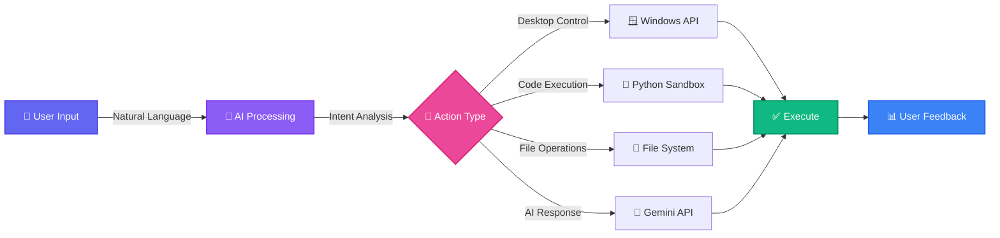
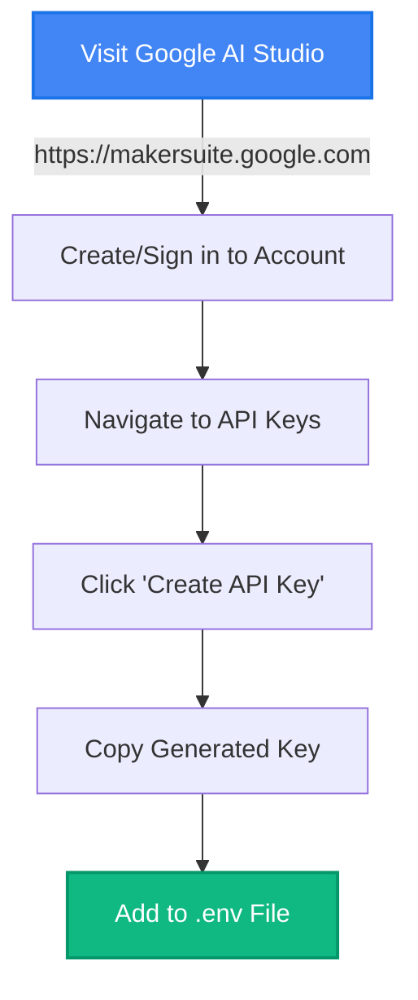
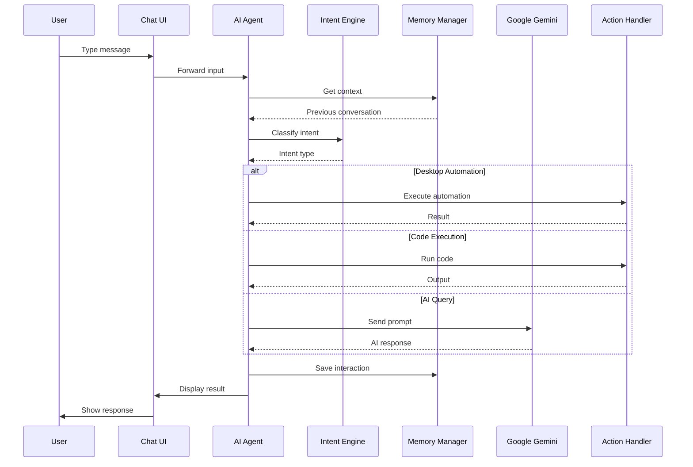
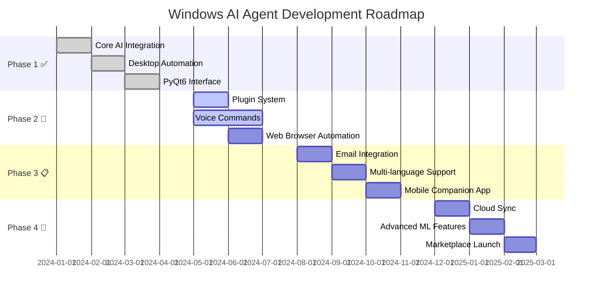

<div align="center">


### _Transform Natural Language into Powerful Windows Automation_

<p align="center">
  
  
  
  
  
</p>

<p align="center">
  
  
  
</p>

<p align="center">
  <a href="#-features">Features</a> •
  <a href="#-quick-start">Quick Start</a> •
  <a href="#-usage">Usage</a> •
  <a href="#-documentation">Docs</a> •
  <a href="#-contributing">Contributing</a> •
  <a href="#-roadmap">Roadmap</a>
</p>

---


</div>

## 🌟 What is Windows AI Agent?

**Windows AI Agent** is a sophisticated desktop assistant that leverages Google Gemini's advanced AI capabilities to provide natural language control over your Windows system. Execute complex tasks, automate workflows, and interact with your computer like never before—all through simple conversation.

<div align="center">

### 🎯 Why Choose Windows AI Agent?

</div>

<table>
<tr>
<td width="33%" align="center">

<h3>🧠 AI-Powered</h3>
<p>Advanced Google Gemini Pro integration with contextual understanding and conversation memory</p>
</td>
<td width="33%" align="center">

<h3>⚡ Automation</h3>
<p>Control Windows apps, manage files, and execute tasks through natural language commands</p>
</td>
<td width="33%" align="center">

<h3>🔒 Secure</h3>
<p>Sandboxed code execution with local processing and privacy-focused design</p>
</td>
</tr>
</table>

---

## ✨ Features

<details open>
<summary><h3>🎨 Click to explore all features</h3></summary>

<br/>

<table>
<tr>
<td width="50%">

### 🧠 **AI Intelligence**


- 🔮 **Advanced NLU** - Understands complex natural language
- 💭 **Context Awareness** - Remembers conversation history
- 🎯 **Intent Recognition** - Accurately identifies user goals
- 🔄 **Multi-turn Dialogue** - Maintains context across interactions
- 📚 **Learning Capability** - Adapts to user preferences

### 🤖 **Desktop Automation**

- 🪟 **Window Management** - Minimize, maximize, arrange windows
- 🚀 **App Launching** - Open any Windows application
- ⌨️ **Keyboard/Mouse Control** - Automate input actions
- 📋 **Clipboard Operations** - Copy, paste, manage clipboard
- 🎮 **System Commands** - Execute PowerShell/CMD commands

### 📂 **File Operations**

- 📝 **Create & Edit** - Text files, documents, scripts
- 🔍 **Search & Filter** - Find files by name, type, content
- 🗂️ **Organize** - Batch rename, move, organize files
- 📊 **File Analysis** - Get metadata, statistics, summaries
- 🗜️ **Compression** - Zip, unzip, archive management

</td>
<td width="50%">

### 🎨 **Modern Interface**


- 💎 **Beautiful Design** - Sleek, intuitive chat interface
- 🌓 **Theme Support** - Dark mode, light mode, custom themes
- ⚡ **Real-time Streaming** - Live AI response rendering
- 🎭 **Rich Formatting** - Markdown, code blocks, syntax highlighting
- 📱 **Responsive** - Smooth animations and transitions

### ⚡ **Code Execution**

- 🐍 **Python Sandbox** - Safe, isolated execution environment
- ⏱️ **Timeout Protection** - Prevents infinite loops
- 🛡️ **Security Controls** - Restricted imports and operations
- 📤 **Output Capture** - Real-time stdout/stderr streaming
- ❌ **Error Handling** - Graceful error reporting

### 📊 **System Integration**

- 📸 **Screenshot Capture** - Full screen or active window
- 💻 **System Monitoring** - CPU, memory, disk usage
- 🔍 **Process Management** - List, monitor running processes
- 🌐 **Network Info** - Connection status, IP address
- ⚙️ **System Info** - OS details, hardware specs

</td>
</tr>
</table>

### 🎯 **Workflow Automation**



</details>

---

## 🚀 Quick Start

### 📋 Prerequisites

<table>
<tr>
<td width="50%">

#### System Requirements

```bash
💻 OS: Windows 10/11 (64-bit)
🐍 Python: 3.8 or higher
💾 RAM: 4GB minimum (8GB recommended)
📦 Storage: 500MB free space
🌐 Internet: Active connection for AI
```

</td>
<td width="50%">

#### Required Access

```bash
🔑 Google AI Studio API Key
   └─ Get yours: https://makersuite.google.com/app/apikey

🛡️ Administrator rights (optional)
   └─ For advanced automation features
```

</td>
</tr>
</table>

### ⚡ Installation (5 Minutes)

<details open>
<summary><b>🎬 One-Command Install</b></summary>

```bash
git clone https://github.com/hegdeshashank100/windows_ai_agent.git && cd windows_ai_agent && python -m venv venv && venv\Scripts\activate && pip install -r requirements.txt && copy .env.example .env && echo "✅ Setup complete! Edit .env with your API key, then run: python main.py"
```

</details>

<details>
<summary><b>📝 Step-by-Step Installation</b></summary>

<br/>

**1️⃣ Clone Repository**

```bash
git clone https://github.com/hegdeshashank100/windows_ai_agent.git
cd windows_ai_agent
```

**2️⃣ Create Virtual Environment**

```bash
# Windows Command Prompt
python -m venv venv
venv\Scripts\activate

# PowerShell
python -m venv venv
venv\Scripts\Activate.ps1

# Git Bash
python -m venv venv
source venv/Scripts/activate
```

**3️⃣ Install Dependencies**

```bash
pip install --upgrade pip
pip install -r requirements.txt
```

**4️⃣ Configure Environment**

```bash
copy .env.example .env
notepad .env  # Add your GOOGLE_API_KEY
```

**5️⃣ Launch Agent** 🚀

```bash
python main.py
```

</details>

### 🔑 Get Your API Key

<div align="center">



</div>

---

## 💬 Usage

### 🎮 Interactive Examples

<div align="center">


</div>

#### 💬 Natural Language Commands

<table>
<tr>
<td width="50%">

**🖼️ Screenshots & Images**

```bash
💬 "Take a screenshot"
💬 "Capture my screen and save to desktop"
💬 "Screenshot the active window"
💬 "Take a screenshot named 'meeting.png'"
```

**🚀 Application Control**

```bash
💬 "Open Calculator"
💬 "Launch Chrome and go to YouTube"
💬 "Close all Excel windows"
💬 "Switch to VS Code"
💬 "Maximize this window"
```

**📁 File Management**

```bash
💬 "Create a folder called 'Projects'"
💬 "Make a todo list in Desktop/todo.txt"
💬 "Find all PDFs in Documents"
💬 "Organize Downloads by file type"
💬 "Search for files named 'report'"
```

</td>
<td width="50%">

**💻 Code Execution**

```python
💬 "Run this Python code:
import datetime
print(f'Today is {datetime.datetime.now()}')"

💬 "Calculate factorial of 10 in Python"

💬 "Generate 10 random numbers"

💬 "Execute:
for i in range(5):
    print(f'Count: {i}')"
```

**📊 System Information**

```bash
💬 "Show system information"
💬 "What's my CPU usage?"
💬 "Check disk space"
💬 "Display memory usage"
💬 "List running processes"
💬 "Show network status"
```

**🎯 Productivity Tasks**

```bash
💬 "Calculate 1234 × 5678"
💬 "What's the current time?"
💬 "Create a meeting notes template"
💬 "Open my daily journal"
```

</td>
</tr>
</table>

### ⌨️ Keyboard Shortcuts

<div align="center">

|    Shortcut    |      Action      |  Shortcut  |    Action    |
| :------------: | :--------------: | :--------: | :----------: |
| `Ctrl + Enter` |   Send Message   | `Ctrl + L` |  Clear Chat  |
|   `Ctrl + N`   | New Conversation | `Ctrl + S` |  Save Chat   |
|   `Ctrl + M`   | Minimize to Tray | `Ctrl + Q` |   Quit App   |
|      `F1`      |    Show Help     | `Ctrl + T` | Toggle Theme |

</div>

### 🎨 Advanced Usage

<details>
<summary><b>📸 Automated Screenshot Documentation</b></summary>

```
User: "Take screenshots every 30 seconds for 5 minutes with timestamps"

Agent: Starting screenshot automation...
       ✅ Monitoring started
       📸 screenshot_2026-02-05_14-30-00.png
       📸 screenshot_2026-02-05_14-30-30.png
       📸 screenshot_2026-02-05_14-31-00.png
       ✅ Completed: 10 screenshots saved
```

</details>

<details>
<summary><b>🎨 Batch Image Processing</b></summary>

```
User: "Resize all images in Downloads to 800×600 and move to 'Processed' folder"

Agent: Processing your images:
       🔍 Found 15 images in Downloads
       ✏️ Resizing to 800×600...
       📁 Created 'Processed' folder
       ✅ Processed and moved 15 images
       ⏱️ Completed in 3.2 seconds
```

</details>

<details>
<summary><b>💾 Automated Backup Script</b></summary>

```
User: "Create a Python script to backup Documents to external drive"

Agent: Generated backup script:
       ✅ Created: backup_documents.py

       Features included:
       • Incremental backup
       • Progress tracking
       • Error handling
       • Log file generation
       • Email notification on completion

       Run with: python backup_documents.py
```

</details>

---

## 🏗️ Architecture

### 📂 Project Structure

```
windows_ai_agent/
│
├── 📦 src/                          # Source code directory
│   │
│   ├── 🧠 core/                     # Core AI functionality
│   │   ├── agent.py                 # Main orchestrator & request router
│   │   ├── gemini_client.py         # Google Gemini API integration
│   │   ├── intent_recognition.py    # NLU & intent classification
│   │   └── memory_manager.py        # Conversation history & context
│   │
│   ├── 🎨 ui/                       # User interface components
│   │   ├── chat_window.py           # Main PyQt6 chat interface
│   │   ├── themes.py                # Dark/light theme definitions
│   │   └── widgets.py               # Custom UI widgets
│   │
│   ├── 🤖 automation/               # Windows automation layer
│   │   ├── windows_automation.py    # Desktop control & scripting
│   │   ├── app_launcher.py          # Application management
│   │   └── keyboard_mouse.py        # Input automation
│   │
│   └── 🔧 utils/                    # Utility modules
│       ├── code_executor.py         # Sandboxed Python execution
│       ├── config.py                # Configuration management
│       ├── file_handler.py          # File system operations
│       └── screenshot.py            # Screen capture utilities
│
├── ⚙️ config/                       # Configuration files
│   ├── intents.yaml                 # Intent patterns & responses
│   ├── logging.yaml                 # Logging configuration
│   └── settings.yaml                # Application settings
│
├── 📚 docs/                         # Documentation
│   ├── getting-started.md           # Setup & installation guide
│   ├── api-reference.md             # API documentation
│   ├── examples.md                  # Usage examples & tutorials
│   └── architecture.md              # System design documentation
│
├── 🧪 tests/                        # Test suite
│   ├── test_agent.py                # Agent core tests
│   ├── test_automation.py           # Automation tests
│   ├── test_integration.py          # Integration tests
│   └── conftest.py                  # Pytest configuration
│
├── 📊 logs/                         # Application logs
│   └── agent.log                    # Runtime log file
│
├── 📄 main.py                       # Application entry point
├── 🏃 run.py                        # Alternative launcher
├── 📋 requirements.txt              # Python dependencies
├── 🔐 .env.example                  # Environment variable template
├── 📖 README.md                     # This file
├── 📜 LICENSE                       # MIT License
└── 📝 CHANGELOG.md                  # Version history
```

### 🔄 Data Flow Architecture

<div align="center">



</div>

### 🧩 Module Overview

<table>
<tr>
<th width="25%">Module</th>
<th width="35%">Purpose</th>
<th width="40%">Key Capabilities</th>
</tr>
<tr>
<td><code>agent.py</code></td>
<td>Central orchestrator</td>
<td>Request routing, action dispatch, response coordination</td>
</tr>
<tr>
<td><code>gemini_client.py</code></td>
<td>AI integration</td>
<td>API communication, streaming responses, error handling</td>
</tr>
<tr>
<td><code>intent_recognition.py</code></td>
<td>NLU engine</td>
<td>Pattern matching, entity extraction, context awareness</td>
</tr>
<tr>
<td><code>memory_manager.py</code></td>
<td>State management</td>
<td>History tracking, context retrieval, persistence</td>
</tr>
<tr>
<td><code>chat_window.py</code></td>
<td>User interface</td>
<td>Message display, input handling, theme management</td>
</tr>
<tr>
<td><code>windows_automation.py</code></td>
<td>OS automation</td>
<td>Window control, app launching, system integration</td>
</tr>
<tr>
<td><code>code_executor.py</code></td>
<td>Code sandbox</td>
<td>Safe execution, timeout control, output capture</td>
</tr>
</table>

---

## 🔧 Configuration

### ⚙️ Environment Variables

Create a `.env` file in the project root:

```env
# ━━━━━━━━━━━━━━━━━━━━━━━━━━━━━━━━━━━━━━━━━━━━━━━━━━━━
# 🔑 API CONFIGURATION
# ━━━━━━━━━━━━━━━━━━━━━━━━━━━━━━━━━━━━━━━━━━━━━━━━━━━━
GOOGLE_API_KEY=your_google_api_key_here
GEMINI_MODEL=gemini-1.5-pro

# ━━━━━━━━━━━━━━━━━━━━━━━━━━━━━━━━━━━━━━━━━━━━━━━━━━━━
# 🎛️ FEATURE TOGGLES
# ━━━━━━━━━━━━━━━━━━━━━━━━━━━━━━━━━━━━━━━━━━━━━━━━━━━━
ENABLE_CODE_EXECUTION=true
ENABLE_DESKTOP_AUTOMATION=true
ENABLE_FILE_OPERATIONS=true

# ━━━━━━━━━━━━━━━━━━━━━━━━━━━━━━━━━━━━━━━━━━━━━━━━━━━━
# 🔒 SECURITY SETTINGS
# ━━━━━━━━━━━━━━━━━━━━━━━━━━━━━━━━━━━━━━━━━━━━━━━━━━━━
MAX_CODE_EXECUTION_TIME=30
REQUIRE_CONFIRMATION_FOR_AUTOMATION=true
RESTRICTED_PATHS=C:\Windows,C:\Program Files

# ━━━━━━━━━━━━━━━━━━━━━━━━━━━━━━━━━━━━━━━━━━━━━━━━━━━━
# 🎨 UI PREFERENCES
# ━━━━━━━━━━━━━━━━━━━━━━━━━━━━━━━━━━━━━━━━━━━━━━━━━━━━
THEME=dark                    # Options: dark, light, auto
LOG_LEVEL=INFO                # Options: DEBUG, INFO, WARNING, ERROR
CONVERSATION_MEMORY_SIZE=50   # Number of messages to remember
```

### 🎯 Advanced Configuration

<details>
<summary><b>Custom Intent Patterns</b></summary>

Edit `config/intents.yaml`:

```yaml
intents:
  screenshot:
    patterns:
      - "take a screenshot"
      - "capture screen"
      - "screenshot {area}"
    action: "capture_screenshot"
    confirmation_required: false

  open_application:
    patterns:
      - "open {app}"
      - "launch {app}"
      - "start {app}"
    action: "launch_application"
    confirmation_required: false

  execute_code:
    patterns:
      - "run this code"
      - "execute {code}"
      - "run python code"
    action: "execute_python"
    confirmation_required: true
```

</details>

---

## 📖 Documentation

<div align="center">

### 📚 Comprehensive Documentation Available

| Guide | Description                                           |               Link                |
| :---: | :---------------------------------------------------- | :-------------------------------: |
|  📘   | **Getting Started** - First-time setup and basics     | [Read →](docs/getting-started.md) |
|  📗   | **API Reference** - Module and function documentation |  [Read →](docs/api-reference.md)  |
|  📙   | **Examples & Tutorials** - Step-by-step usage guides  |    [Read →](docs/examples.md)     |
|  📕   | **Configuration** - Advanced customization options    |  [Read →](docs/configuration.md)  |
|  📓   | **Troubleshooting** - Common issues and solutions     | [Read →](docs/troubleshooting.md) |
|  📔   | **Architecture** - System design and internals        |  [Read →](docs/architecture.md)   |

</div>

---

## 🤝 Contributing

<div align="center">

### 💙 We Love Contributions!


<br/><br/>


</div>

### 🚀 How to Contribute


<details>
<summary><b>📋 Contribution Guidelines</b></summary>

<br/>

**Code Quality Standards**

- ✅ Follow PEP 8 style guidelines
- ✅ Use type hints for function signatures
- ✅ Write descriptive docstrings
- ✅ Add unit tests for new features
- ✅ Keep functions small and focused
- ✅ Use meaningful variable names

**Before Submitting PR**

```bash
# Format code
black src/

# Check linting
pylint src/

# Run tests
pytest tests/

# Update documentation
# Update CHANGELOG.md
```

**Commit Message Format**

```
<type>(<scope>): <subject>

<body>

<footer>
```

Types: `feat`, `fix`, `docs`, `style`, `refactor`, `test`, `chore`

Example:

```
feat(automation): Add window snapping functionality

Implement window snapping to screen edges and corners
for improved window management automation.

Closes #123
```

</details>

### 🎯 Areas for Contribution

<table>
<tr>
<td width="50%">

**🌟 High Priority**

- 🌐 Multi-language support
- 🎙️ Voice command integration
- 🌐 Web browser automation
- 📧 Email integration
- 🔌 Plugin system

</td>
<td width="50%">

**💡 Good First Issues**

- 📝 Documentation improvements
- 🐛 Bug fixes
- 🎨 UI/UX enhancements
- 🧪 Test coverage
- 🌍 Localization

</td>
</tr>
</table>

### 👥 Contributors

<div align="center">

**Thanks to all amazing contributors! 🙏**

<a href="https://github.com/hegdeshashank100/windows_ai_agent/graphs/contributors">
  
</a>

</div>

---

## 🗺️ Roadmap

<div align="center">

### 🎯 Development Timeline


</div>



### Current Version: v1.0.0 ✅

<table>
<tr>
<th>✅ Completed</th>
<th>🚧 In Progress</th>
<th>📋 Planned</th>
</tr>
<tr>
<td>

- ✅ Google Gemini integration
- ✅ Desktop automation
- ✅ File operations
- ✅ Code execution
- ✅ PyQt6 interface
- ✅ Theme support
- ✅ Memory management

</td>
<td>

- 🚧 Plugin system
- 🚧 Voice commands
- 🚧 Browser automation
- 🚧 Email integration
- 🚧 Advanced logging

</td>
<td>

- 📋 Multi-language UI
- 📋 Cloud sync
- 📋 Mobile app
- 📋 Marketplace
- 📋 Advanced ML
- 📋 Team features

</td>
</tr>
</table>

<details>
<summary><b>🔮 Future Enhancements (v2.0+)</b></summary>

<br/>

**🎙️ Voice & Speech**

- Speech-to-text input
- Text-to-speech responses
- Voice activation ("Hey Agent")
- Multi-language voice support

**🌐 Web & Cloud**

- Web scraping capabilities
- Form filling automation
- Cloud storage integration
- Cross-device synchronization

**📧 Communication**

- Email reading and sending
- Calendar management
- Slack/Teams integration
- SMS notifications

**🔌 Extensibility**

- Plugin marketplace
- Custom action creation
- Third-party integrations
- API for developers

**🤖 Advanced AI**

- Image understanding
- Document analysis
- Video processing
- Predictive suggestions
- Usage pattern learning

**📱 Mobile & Remote**

- Mobile companion app
- Remote control
- Push notifications
- Task delegation

</details>

---

## 🔒 Security & Privacy

<div align="center">

### 🛡️ Your Security is Our Priority

</div>

<table>
<tr>
<td width="50%">

### 🔐 Security Measures

- ✅ **API Key Protection**
  - Never stored in code
  - Environment variables only
  - Encrypted at rest

- ✅ **Code Execution Safety**
  - Sandboxed environment
  - Restricted imports
  - Timeout protection
  - Resource limits

- ✅ **User Confirmation**
  - Optional prompts for sensitive ops
  - Configurable security levels
  - Audit logging

- ✅ **Local Processing**
  - Conversation history local
  - No data collection
  - Privacy-first design

</td>
<td width="50%">

### 🔍 Privacy Policy

- ✅ **Zero Data Collection**
  - No usage tracking
  - No analytics
  - No telemetry
  - No third-party sharing

- ✅ **Local First**
  - Everything runs locally
  - Full control over data
  - No cloud dependencies

- ✅ **API Usage Only**
  - Only queries to Gemini API
  - No other external calls
  - Transparent communication

- ✅ **Open Source**
  - Full code transparency
  - Community audited
  - No hidden features

</td>
</tr>
</table>

### ⚠️ Security Best Practices

```bash
# ✅ DO
✓ Keep .env file secure and private
✓ Use separate API keys for dev/prod
✓ Review code before execution
✓ Keep dependencies updated
✓ Enable confirmation for automation
✓ Regular backups of important data

# ❌ DON'T
✗ Share your .env file
✗ Commit API keys to Git
✗ Run untrusted code
✗ Disable safety features in production
✗ Grant unnecessary permissions
```

### 🚨 Reporting Security Issues

<div align="center">

Found a security vulnerability? **Please report it responsibly.**

📧 Email: **security@windowsaiagent.com**  
🔒 Use GitHub Security Advisories  
⏰ We respond within **48 hours**

**Do not** create public issues for security vulnerabilities.

</div>

---

## ❓ FAQ

<details>
<summary><b>🤔 What AI models does this support?</b></summary>

<br/>

Currently supports **Google Gemini** models:

| Model              | Best For                          | Performance |
| ------------------ | --------------------------------- | ----------- |
| `gemini-1.5-pro`   | Complex tasks, detailed responses | ⭐⭐⭐⭐⭐  |
| `gemini-1.5-flash` | Quick queries, cost-effective     | ⭐⭐⭐⭐    |

**Coming Soon:**

- OpenAI GPT-4
- Anthropic Claude
- Local LLMs (Llama, Mistral)

</details>

<details>
<summary><b>🔒 Is my data safe and private?</b></summary>

<br/>

**Absolutely!** Your privacy is our top priority:

✅ **100% Local Processing** - All conversation history stored on your machine  
✅ **No Data Collection** - We don't collect or store any user data  
✅ **API Queries Only** - Only natural language queries sent to Google's API  
✅ **Open Source** - Full code transparency, audit it yourself  
✅ **No Telemetry** - No tracking, analytics, or hidden features

</details>

<details>
<summary><b>💻 Can I use this on Linux or Mac?</b></summary>

<br/>

**Currently:** Windows-specific (desktop automation features)  
**Future:** Cross-platform support planned for v2.0

The core AI functionality works on any platform, but automation features are Windows-only for now.

</details>

<details>
<summary><b>💰 How much does it cost to use?</b></summary>

<br/>

**Software:** 100% Free and Open Source (MIT License)  
**API Usage:** Google Gemini has a generous free tier

| Model            | Free Tier          | After Free Tier |
| ---------------- | ------------------ | --------------- |
| Gemini 1.5 Pro   | 50 requests/day    | Pay per use     |
| Gemini 1.5 Flash | 1,500 requests/day | Very affordable |

Check [Google AI Pricing](https://ai.google.dev/pricing) for current rates.

</details>

<details>
<summary><b>🎨 Can I customize the interface?</b></summary>

<br/>

**Yes!** Highly customizable:

✅ Dark/Light themes  
✅ Custom color schemes  
✅ Font sizes and families  
✅ Window layouts  
✅ Keyboard shortcuts  
✅ UI scaling

Edit `config/settings.yaml` or use in-app settings.

</details>

<details>
<summary><b>🔌 Can I add custom commands?</b></summary>

<br/>

**Absolutely!** Two ways to extend:

1. **Edit Intent Patterns** - Modify `config/intents.yaml`
2. **Create Plugins** - Plugin system (coming in v1.1)

Example custom intent:

```yaml
custom_greeting:
  patterns:
    - "hello agent"
    - "hi there"
  response: "Hello! How can I help you today?"
```

</details>

<details>
<summary><b>🌐 Can it access the internet?</b></summary>

<br/>

**Currently:**

- ✅ Open web browsers
- ✅ Launch URLs
- ✅ Execute code with HTTP requests

**Coming Soon (v1.1):**

- 🚧 Web scraping
- 🚧 Browser automation
- 🚧 API integrations
- 🚧 Real-time data fetching

</details>

<details>
<summary><b>🔄 How do I update to the latest version?</b></summary>

<br/>

```bash
# Navigate to project directory
cd windows_ai_agent

# Pull latest changes
git pull origin main

# Update dependencies
pip install --upgrade -r requirements.txt

# Run migrations (if any)
python migrate.py
```

**Always check** [CHANGELOG.md](CHANGELOG.md) for breaking changes!

</details>

<details>
<summary><b>🆘 Where can I get help?</b></summary>

<br/>

**Multiple support channels:**

| Channel                                                                                   | Purpose            | Response Time |
| ----------------------------------------------------------------------------------------- | ------------------ | ------------- |
| 📖 [Documentation](docs/)                                                                 | Guides & tutorials | Instant       |
| 💬 [GitHub Discussions](https://github.com/hegdeshashank100/windows_ai_agent/discussions) | Questions & ideas  | 1-2 days      |
| 🐛 [GitHub Issues](https://github.com/hegdeshashank100/windows_ai_agent/issues)           | Bug reports        | 2-3 days      |
| 📧 Email                                                                                  | Private inquiries  | 3-5 days      |

</details>

---

## 📊 Performance Metrics

<div align="center">

### ⚡ Lightning Fast Performance

<table>
<tr>
<td align="center">
<h3>Response Time</h3>

<p>Average AI response latency</p>
</td>
<td align="center">
<h3>Memory Usage</h3>

<p>Typical RAM consumption</p>
</td>
<td align="center">
<h3>CPU Usage</h3>

<p>Idle CPU utilization</p>
</td>
<td align="center">
<h3>Startup Time</h3>

<p>Cold start duration</p>
</td>
</tr>
</table>

</div>

---

## 🚨 Troubleshooting

<details>
<summary><b>⚠️ Common Issues & Solutions</b></summary>

<br/>

| Issue                    | Solution                                                                              |
| ------------------------ | ------------------------------------------------------------------------------------- |
| `ModuleNotFoundError`    | Activate venv: `venv\Scripts\activate` then `pip install -r requirements.txt`         |
| `API Key Invalid`        | Verify `GOOGLE_API_KEY` in `.env` file is correct                                     |
| `PyQt6 Import Error`     | Install [Visual C++ Redistributables](https://aka.ms/vs/17/release/vc_redist.x64.exe) |
| `Permission Denied`      | Run terminal as Administrator for automation features                                 |
| `Window Not Responding`  | Check logs in `logs/agent.log` for errors                                             |
| `Code Execution Timeout` | Increase `MAX_CODE_EXECUTION_TIME` in `.env`                                          |

**Still having issues?** Check [docs/troubleshooting.md](docs/troubleshooting.md) or open an issue.

</details>

---

## 📄 License

<div align="center">

### MIT License

**Free to use, modify, and distribute**

[](LICENSE)

Copyright © 2026 [Shashank Hegde](https://github.com/hegdeshashank100)

<details>
<summary><b>📜 Full License Text</b></summary>

```
MIT License

Copyright (c) 2026 Shashank Hegde

Permission is hereby granted, free of charge, to any person obtaining a copy
of this software and associated documentation files (the "Software"), to deal
in the Software without restriction, including without limitation the rights
to use, copy, modify, merge, publish, distribute, sublicense, and/or sell
copies of the Software, and to permit persons to whom the Software is
furnished to do so, subject to the following conditions:

The above copyright notice and this permission notice shall be included in all
copies or substantial portions of the Software.

THE SOFTWARE IS PROVIDED "AS IS", WITHOUT WARRANTY OF ANY KIND, EXPRESS OR
IMPLIED, INCLUDING BUT NOT LIMITED TO THE WARRANTIES OF MERCHANTABILITY,
FITNESS FOR A PARTICULAR PURPOSE AND NONINFRINGEMENT. IN NO EVENT SHALL THE
AUTHORS OR COPYRIGHT HOLDERS BE LIABLE FOR ANY CLAIM, DAMAGES OR OTHER
LIABILITY, WHETHER IN AN ACTION OF CONTRACT, TORT OR OTHERWISE, ARISING FROM,
OUT OF OR IN CONNECTION WITH THE SOFTWARE OR THE USE OR OTHER DEALINGS IN THE
SOFTWARE.
```

</details>

</div>

---

## 🙏 Acknowledgments

<div align="center">

### 💙 Built With Love Using

<br/>


<br/>

**Special Thanks To:**

- 🤖 **Google** for Gemini API
- 🎨 **Riverbank Computing** for PyQt6
- 🐍 **Python Software Foundation**
- 👥 **All Contributors** to this project
- 💻 **Open Source Community**

<br/>


</div>

---

<div align="center">

### 📞 Connect & Support

<br/>

[](https://github.com/hegdeshashank100/windows_ai_agent)
[](https://github.com/hegdeshashank100/windows_ai_agent/issues)
[](https://github.com/hegdeshashank100/windows_ai_agent/discussions)
[](docs/)

<br/>

### ⭐ Star History

[](https://star-history.com/#hegdeshashank100/windows_ai_agent&Date)

<br/>

---

### Made with ❤️ by developers, for developers

<br/>

**If you find this project helpful, please consider giving it a ⭐!**

<br/>


<br/>

[⬆ Back to Top](#)

</div>
