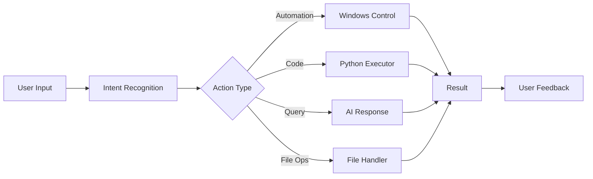

<div align="center">

# 🤖 Windows AI Agent

### _Your Intelligent Desktop Companion_


_A sophisticated AI-powered desktop assistant leveraging Google Gemini's advanced capabilities to transform natural language into powerful Windows automation, intelligent task execution, and seamless desktop control._

[Features](#-features) • [Installation](#️-installation) • [Usage](#-usage) • [Documentation](#-documentation) • [Contributing](#-contributing)

---

</div>

## ✨ Features

<table>
<tr>
<td width="50%">

### 🧠 **AI Intelligence**

- 🔮 **Google Gemini Pro Integration**
  - Advanced natural language understanding
  - Context-aware conversation memory
  - Multi-turn dialogue support
  - Intelligent intent recognition

- 💾 **Persistent Memory**
  - Remembers past interactions
  - Learns user preferences
  - Context retention across sessions

</td>
<td width="50%">

### 🎨 **User Experience**

- 🖥️ **Modern PyQt6 Interface**
  - Beautiful, intuitive chat UI
  - Dark/Light theme support
  - Real-time response streaming
  - Rich text formatting

- 📱 **Responsive Design**
  - Smooth animations
  - Keyboard shortcuts
  - Minimizable to system tray

</td>
</tr>
<tr>
<td width="50%">

### 🤖 **Automation Capabilities**

- 🎯 **Desktop Control**
  - Window management
  - Application launching
  - Keyboard/mouse automation
  - System commands

- 📂 **File Operations**
  - Create, read, modify files
  - Directory management
  - Search and organize
  - Batch operations

</td>
<td width="50%">

### 🔧 **Advanced Features**

- ⚡ **Safe Code Execution**
  - Sandboxed Python environment
  - Real-time code running
  - Error handling & validation
  - Output capture

- 📊 **System Integration**
  - Screenshot capture
  - System monitoring
  - Process management
  - Clipboard operations

</td>
</tr>
</table>

### 🎯 **Core Capabilities**



---

## 📋 Prerequisites

<table>
<tr>
<td>

### System Requirements

- 💻 **OS**: Windows 10/11 (64-bit)
- 🐍 **Python**: 3.8 or higher
- 💾 **RAM**: 4GB minimum (8GB recommended)
- 📦 **Storage**: 500MB free space

</td>
<td>

### Required Accounts & Keys

- 🔑 **Google AI Studio API Key** ([Get it here](https://makersuite.google.com/app/apikey))
- 🌐 Internet connection for AI features
- 🛡️ Administrator rights (for some automation features)

</td>
</tr>
</table>

---

## 🛠️ Installation

### Quick Start (5 minutes)

```bash
# 1️⃣ Clone the repository
git clone https://github.com/hegdeshashank100/windows_ai_agent.git
cd windows_ai_agent

# 2️⃣ Create and activate virtual environment
python -m venv venv
venv\Scripts\activate

# 3️⃣ Install dependencies
pip install -r requirements.txt

# 4️⃣ Configure environment
copy .env.example .env
# Edit .env and add your GOOGLE_API_KEY

# 5️⃣ Launch the agent
python main.py
```

### 📝 Detailed Installation Steps

<details>
<summary><b>Step 1: Clone the Repository</b></summary>

```bash
git clone https://github.com/hegdeshashank100/windows_ai_agent.git
cd windows_ai_agent
```

Or download the ZIP file from GitHub and extract it.

</details>

<details>
<summary><b>Step 2: Set Up Python Environment</b></summary>

Create an isolated virtual environment:

```bash
# Windows Command Prompt
python -m venv venv
venv\Scripts\activate.bat

# Windows PowerShell
python -m venv venv
venv\Scripts\Activate.ps1

# Git Bash
python -m venv venv
source venv/Scripts/activate
```

You should see `(venv)` in your terminal prompt.

</details>

<details>
<summary><b>Step 3: Install Dependencies</b></summary>

```bash
# Upgrade pip first
python -m pip install --upgrade pip

# Install all required packages
pip install -r requirements.txt
```

**Core Dependencies:**

- `google-generativeai` - Google Gemini API
- `PyQt6` - Modern UI framework
- `python-dotenv` - Environment configuration
- `pyautogui` - Desktop automation
- `Pillow` - Image processing
- `psutil` - System monitoring

</details>

<details>
<summary><b>Step 4: Configure API Keys</b></summary>

1. Get your Google API key from [Google AI Studio](https://makersuite.google.com/app/apikey)

2. Create a `.env` file in the project root:

```bash
copy .env.example .env
```

3. Edit `.env` and add your credentials:

```env
# Google Gemini API Configuration
GOOGLE_API_KEY=your_api_key_here
GEMINI_MODEL=gemini-1.5-pro

# Feature Toggles
ENABLE_CODE_EXECUTION=true
ENABLE_DESKTOP_AUTOMATION=true
ENABLE_FILE_OPERATIONS=true

# Safety Settings
MAX_CODE_EXECUTION_TIME=30
REQUIRE_CONFIRMATION_FOR_AUTOMATION=true
```

</details>

<details>
<summary><b>Step 5: Run the Application</b></summary>

```bash
# Start the AI Agent
python main.py

# Or use the run script
python run.py
```

The chat window should appear, and you're ready to interact with your AI agent!

</details>

### 🚨 Troubleshooting Installation

| Issue                 | Solution                                                           |
| --------------------- | ------------------------------------------------------------------ |
| `ModuleNotFoundError` | Ensure virtual environment is activated and dependencies installed |
| `API Key Invalid`     | Verify your Google API key in `.env` file                          |
| `PyQt6 Import Error`  | Install Visual C++ Redistributables from Microsoft                 |
| `Permission Denied`   | Run terminal as Administrator for automation features              |
| `Port Already in Use` | Close other applications or change port in config                  |

---

## 🔧 Configuration

### Environment Variables

The `.env` file contains all configuration options:

<table>
<tr>
<th>Variable</th>
<th>Description</th>
<th>Default</th>
<th>Options</th>
</tr>
<tr>
<td><code>GOOGLE_API_KEY</code></td>
<td>Your Google AI API key</td>
<td><em>Required</em></td>
<td>Get from <a href="https://makersuite.google.com/">AI Studio</a></td>
</tr>
<tr>
<td><code>GEMINI_MODEL</code></td>
<td>Gemini model to use</td>
<td><code>gemini-1.5-pro</code></td>
<td><code>gemini-1.5-pro</code>, <code>gemini-1.5-flash</code></td>
</tr>
<tr>
<td><code>ENABLE_CODE_EXECUTION</code></td>
<td>Allow Python code execution</td>
<td><code>true</code></td>
<td><code>true</code>, <code>false</code></td>
</tr>
<tr>
<td><code>ENABLE_DESKTOP_AUTOMATION</code></td>
<td>Enable desktop control</td>
<td><code>true</code></td>
<td><code>true</code>, <code>false</code></td>
</tr>
<tr>
<td><code>ENABLE_FILE_OPERATIONS</code></td>
<td>Allow file system access</td>
<td><code>true</code></td>
<td><code>true</code>, <code>false</code></td>
</tr>
<tr>
<td><code>MAX_CODE_EXECUTION_TIME</code></td>
<td>Timeout for code execution</td>
<td><code>30</code></td>
<td>Seconds (1-300)</td>
</tr>
<tr>
<td><code>CONVERSATION_MEMORY_SIZE</code></td>
<td>Messages to remember</td>
<td><code>50</code></td>
<td>Number of messages</td>
</tr>
</table>

### Advanced Configuration

Edit `config/intents.yaml` to customize intent recognition patterns and responses.

```yaml
intents:
  screenshot:
    patterns:
      - "take a screenshot"
      - "capture screen"
    action: "capture_screenshot"

  open_app:
    patterns:
      - "open {app}"
      - "launch {app}"
    action: "launch_application"
```

---

## 💬 Usage

### 🎮 Quick Start Guide

1. **Launch the application**: Run `python main.py`
2. **Type your request** in the chat interface
3. **Press Enter** or click Send
4. **Get instant results** from your AI assistant

### 📚 Command Categories

<details>
<summary><b>🖼️ Screenshot & Image Operations</b></summary>

```
"Take a screenshot"
"Capture my screen and save to desktop"
"Take a screenshot and name it 'meeting_notes.png'"
"Screenshot the active window only"
```

**Features:**

- Full screen or active window capture
- Auto-save with custom names
- Clipboard integration
- Multiple format support (PNG, JPG)

</details>

<details>
<summary><b>🚀 Application Control</b></summary>

```
"Open Calculator"
"Launch Notepad"
"Start Chrome and open YouTube"
"Close all Excel windows"
"Switch to Visual Studio Code"
```

**Supported Apps:**

- Native Windows apps (Calculator, Notepad, Paint, etc.)
- Microsoft Office suite
- Popular browsers (Chrome, Firefox, Edge)
- Custom applications (provide path)

</details>

<details>
<summary><b>📁 File & Folder Management</b></summary>

```
"Create a new folder called 'Projects' on desktop"
"Make a text file named 'todo.txt' with my tasks"
"Show me all PDF files in Documents"
"Organize my Downloads folder by file type"
"Search for files containing 'report' in their name"
```

**Capabilities:**

- File creation, deletion, moving
- Content reading and writing
- Search and filtering
- Batch operations

</details>

<details>
<summary><b>🪟 Window Management</b></summary>

```
"Minimize all windows"
"Maximize current window"
"Show desktop"
"Arrange windows side by side"
"List all open applications"
```

</details>

<details>
<summary><b>💻 Code Execution</b></summary>

```
"Run this Python code:
import random
print(f'Lucky number: {random.randint(1, 100)}')"

"Execute:
for i in range(5):
    print(f'Count: {i}')"

"Calculate the factorial of 10 using Python"
```

**Safety Features:**

- Restricted imports (no system-critical modules)
- Execution timeout
- Error handling and reporting
- Output capture

</details>

<details>
<summary><b>📊 System Information</b></summary>

```
"Show system information"
"What's my CPU usage?"
"Check available disk space"
"Display memory usage"
"List running processes"
"Show network status"
```

</details>

<details>
<summary><b>🎯 Productivity Tasks</b></summary>

```
"Set a reminder for 3 PM"
"Calculate 1234 * 5678"
"What's the current time and date?"
"Open my daily journal and add today's entry"
"Create a meeting notes template"
```

</details>

### 🎨 Advanced Usage Examples

#### Example 1: Automated Screenshot Documentation

```
User: "Take screenshots every 30 seconds for the next 5 minutes and save them with timestamps"

Agent: I'll create a monitoring script to capture screenshots at regular intervals...
       ✅ Starting screenshot automation
       📸 Captured: screenshot_2026-02-05_14-30-00.png
       📸 Captured: screenshot_2026-02-05_14-30-30.png
       ...
```

#### Example 2: Batch File Processing

```
User: "Find all images in my Downloads folder, resize them to 800x600, and move them to a new 'Processed' folder"

Agent: I'll process your images:
       🔍 Found 15 images in Downloads
       ✏️ Resizing images...
       📁 Creating 'Processed' folder
       ✅ Moved 15 processed images
```

#### Example 3: System Automation

```
User: "Create a Python script that backs up my Documents folder to an external drive"

Agent: I'll generate a backup script for you...
       ✅ Created backup_documents.py
       📝 Script includes:
          - Incremental backup
          - Progress tracking
          - Error handling
          - Log file generation
```

### ⌨️ Keyboard Shortcuts

| Shortcut       | Action             |
| -------------- | ------------------ |
| `Ctrl + Enter` | Send message       |
| `Ctrl + L`     | Clear conversation |
| `Ctrl + S`     | Save conversation  |
| `Ctrl + N`     | New conversation   |
| `Ctrl + M`     | Minimize to tray   |
| `Ctrl + Q`     | Quit application   |
| `F1`           | Show help          |

---

## 🏗️ Project Structure

```
windows_ai_agent/
│
├── 📁 src/                          # Source code
│   ├── 🧠 core/                     # Core AI functionality
│   │   ├── agent.py                 # Main agent orchestrator
│   │   ├── gemini_client.py         # Google Gemini API client
│   │   ├── intent_recognition.py    # NLU and intent parsing
│   │   └── memory_manager.py        # Conversation memory
│   │
│   ├── 🎨 ui/                       # User interface
│   │   └── chat_window.py           # PyQt6 chat interface
│   │
│   ├── 🤖 automation/               # Windows automation
│   │   └── windows_automation.py    # Desktop control & scripting
│   │
│   └── 🔧 utils/                    # Utility modules
│       ├── code_executor.py         # Safe Python execution
│       └── config.py                # Configuration management
│
├── ⚙️ config/                       # Configuration files
│   ├── intents.yaml                 # Intent recognition patterns
│   └── logging.yaml                 # Logging configuration
│
├── 📝 docs/                         # Documentation
│   └── examples.md                  # Usage examples
│
├── 🧪 tests/                        # Unit tests
│   ├── test_agent.py                # Agent tests
│   └── test_integration.py          # Integration tests
│
├── 📊 logs/                         # Application logs
│   └── agent.log                    # Runtime logs
│
├── 📄 main.py                       # Application entry point
├── 🏃 run.py                        # Alternative launcher
├── 📋 requirements.txt              # Python dependencies
├── 🔐 .env.example                  # Environment template
├── 📖 README.md                     # This file
└── 📜 LICENSE                       # MIT License
```

### 🔍 Module Descriptions

<table>
<tr>
<th>Module</th>
<th>Description</th>
<th>Key Features</th>
</tr>
<tr>
<td><code>agent.py</code></td>
<td>Central orchestrator</td>
<td>Request routing, action dispatch, response formatting</td>
</tr>
<tr>
<td><code>gemini_client.py</code></td>
<td>AI integration</td>
<td>API communication, streaming, error handling</td>
</tr>
<tr>
<td><code>intent_recognition.py</code></td>
<td>NLU engine</td>
<td>Pattern matching, entity extraction, context awareness</td>
</tr>
<tr>
<td><code>memory_manager.py</code></td>
<td>Conversation state</td>
<td>History tracking, context retrieval, persistence</td>
</tr>
<tr>
<td><code>chat_window.py</code></td>
<td>GUI interface</td>
<td>Message display, input handling, theming</td>
</tr>
<tr>
<td><code>windows_automation.py</code></td>
<td>OS automation</td>
<td>Window control, keyboard/mouse, app launching</td>
</tr>
<tr>
<td><code>code_executor.py</code></td>
<td>Code sandbox</td>
<td>Safe execution, timeout, output capture</td>
</tr>
</table>

### 🔄 Architecture Flow

```
┌─────────────┐
│   User UI   │
└──────┬──────┘
       │ Input
       ▼
┌─────────────────┐
│  Intent Engine  │ ◄── config/intents.yaml
└──────┬──────────┘
       │ Classified Intent
       ▼
┌─────────────────┐
│   AI Agent      │ ◄─► Memory Manager
└──────┬──────────┘     └─► agent_memory.json
       │
       ├──► 🤖 Desktop Automation
       ├──► 💻 Code Executor
       ├──► 📁 File Handler
       └──► 🧠 Gemini AI ──► Google Cloud
                │
                ▼
            Response
                │
                ▼
         ┌──────────┐
         │  User UI │
         └──────────┘
```

---

## 📖 Documentation

Comprehensive documentation is available in the `/docs` folder:

- 📘 **[Getting Started Guide](docs/getting-started.md)** - First-time setup and basics
- 📗 **[API Reference](docs/api-reference.md)** - Module and function documentation
- 📙 **[Examples & Tutorials](docs/examples.md)** - Step-by-step usage guides
- 📕 **[Configuration Guide](docs/configuration.md)** - Advanced configuration options
- 📓 **[Troubleshooting](docs/troubleshooting.md)** - Common issues and solutions
- 📔 **[Architecture](docs/architecture.md)** - System design and internals

---

## 🤝 Contributing

We love contributions! Whether it's bug reports, feature requests, or code contributions, all are welcome.

### 🌟 How to Contribute

1. **Fork the repository**

   ```bash
   # Click the "Fork" button on GitHub
   git clone https://github.com/YOUR-USERNAME/windows_ai_agent.git
   ```

2. **Create a feature branch**

   ```bash
   git checkout -b feature/amazing-feature
   ```

3. **Make your changes**
   - Write clean, documented code
   - Follow PEP 8 style guidelines
   - Add tests for new features
   - Update documentation as needed

4. **Commit your changes**

   ```bash
   git add .
   git commit -m "✨ Add amazing feature"
   ```

5. **Push to your fork**

   ```bash
   git push origin feature/amazing-feature
   ```

6. **Open a Pull Request**
   - Describe your changes clearly
   - Reference any related issues
   - Wait for review and feedback

### 📋 Contribution Guidelines

- 🐛 **Bug Reports**: Use the issue template, include steps to reproduce
- 💡 **Feature Requests**: Describe the feature and its use case
- 🔧 **Code Style**: Follow PEP 8, use type hints
- ✅ **Testing**: Add tests for new functionality
- 📝 **Documentation**: Update docs for API changes
- 🔍 **Code Review**: All PRs require review before merging

### 🎯 Areas for Contribution

- 🌐 **Multi-language support** (localization)
- 🎨 **UI/UX improvements** (themes, layouts)
- 🤖 **New automation actions** (system integrations)
- 🧪 **Test coverage** (unit and integration tests)
- 📚 **Documentation** (tutorials, examples)
- 🐛 **Bug fixes** (check open issues)

### 👥 Contributors

Thanks to all the amazing contributors who have helped build this project!

<a href="https://github.com/hegdeshashank100/windows_ai_agent/graphs/contributors">
  
</a>

---

## 🗺️ Roadmap

### 🎯 Current Version (v1.0)

- ✅ Google Gemini integration
- ✅ Basic desktop automation
- ✅ File operations
- ✅ Code execution sandbox
- ✅ PyQt6 chat interface

### 🔮 Upcoming Features (v1.1)

- [ ] **Voice Input/Output**
  - Speech-to-text integration
  - Text-to-speech responses
  - Voice command activation

- [ ] **Browser Automation**
  - Web scraping capabilities
  - Form filling
  - Automated browsing tasks

- [ ] **Email Integration**
  - Read and send emails
  - Email organization
  - Calendar management

### 🚀 Future Enhancements (v2.0)

- [ ] **Plugin System**
  - Custom action plugins
  - Third-party integrations
  - API for extensions

- [ ] **Machine Learning**
  - Usage pattern learning
  - Personalized suggestions
  - Predictive actions

- [ ] **Multi-Modal Support**
  - Image understanding
  - Document analysis
  - Video processing

- [ ] **Cloud Sync**
  - Settings synchronization
  - Conversation history backup
  - Cross-device support

- [ ] **Mobile Companion App**
  - Remote control
  - Notifications
  - Task delegation

## 📄 License

This project is licensed under the **MIT License** - see the [LICENSE](LICENSE) file for details.

```
MIT License

Copyright (c) 2026 Shashank Hegde

Permission is hereby granted, free of charge, to any person obtaining a copy
of this software and associated documentation files (the "Software"), to deal
in the Software without restriction, including without limitation the rights
to use, copy, modify, merge, publish, distribute, sublicense, and/or sell
copies of the Software, and to permit persons to whom the Software is
furnished to do so, subject to the following conditions:

The above copyright notice and this permission notice shall be included in all
copies or substantial portions of the Software.

THE SOFTWARE IS PROVIDED "AS IS", WITHOUT WARRANTY OF ANY KIND, EXPRESS OR
IMPLIED, INCLUDING BUT NOT LIMITED TO THE WARRANTIES OF MERCHANTABILITY,
FITNESS FOR A PARTICULAR PURPOSE AND NONINFRINGEMENT.
```

---

## 🔒 Security & Privacy

Your security and privacy are our top priorities.

### 🛡️ Security Measures

- **🔐 API Key Protection**: Credentials stored in `.env`, never in code
- **⏱️ Code Execution Timeout**: Prevents infinite loops and hangs
- **🚫 Restricted Imports**: Blocks dangerous system modules
- **✅ User Confirmation**: Optional prompts for sensitive operations
- **📝 Audit Logging**: All actions logged for review
- **🔒 Local Processing**: Conversation history stays on your device

### 🔍 Privacy Policy

- ✅ **No Data Collection**: We don't collect or store your data
- ✅ **Local First**: Everything runs on your machine
- ✅ **API Usage**: Only queries sent to Google Gemini
- ✅ **Open Source**: Full transparency, audit the code yourself
- ✅ **No Telemetry**: No usage tracking or analytics

### ⚠️ Security Best Practices

1. **Never share your `.env` file** or API keys
2. **Review code** before allowing execution
3. **Use separate API keys** for testing and production
4. **Keep dependencies updated** with `pip install --upgrade -r requirements.txt`
5. **Limit automation permissions** in production environments
6. **Regular backups** of important data before automation

### 🚨 Reporting Security Issues

Found a security vulnerability? Please report it privately:

- 📧 Email: security@yourproject.com
- 🔒 Use GitHub Security Advisories
- ⏰ We'll respond within 48 hours

**Do not** create public issues for security vulnerabilities.

---

## ❓ FAQ

<details>
<summary><b>What AI models does this support?</b></summary>

Currently supports Google Gemini models:

- `gemini-1.5-pro` (recommended) - Most capable, best for complex tasks
- `gemini-1.5-flash` - Faster, more cost-effective for simple queries

Future support planned for OpenAI GPT, Anthropic Claude, and local LLMs.

</details>

<details>
<summary><b>Is my data safe?</b></summary>

Yes! All conversation history and settings are stored locally on your machine. Only your natural language queries are sent to Google's API for processing. We don't collect or store any user data on external servers.

</details>

<details>
<summary><b>Can I use this on Linux or Mac?</b></summary>

Currently, the desktop automation features are Windows-specific. However, the core AI functionality works on any platform. Cross-platform support is planned for v2.0.

</details>

<details>
<summary><b>How much does it cost to use?</b></summary>

The software is free and open-source. However, Google Gemini API usage may incur costs based on your usage. Google offers a generous free tier for testing. Check [Google AI pricing](https://ai.google.dev/pricing) for details.

</details>

<details>
<summary><b>Can I add custom commands?</b></summary>

Yes! Edit `config/intents.yaml` to add custom intent patterns. Plugin system for custom actions is planned for v2.0.

</details>

<details>
<summary><b>What's the difference between this and other AI assistants?</b></summary>

Unlike cloud-based assistants, this agent:

- ✅ Runs locally on your machine
- ✅ Has direct Windows system access
- ✅ Can execute arbitrary Python code
- ✅ Full control and customization
- ✅ Privacy-focused design
- ✅ Open source and auditable

</details>

<details>
<summary><b>Can it access the internet?</b></summary>

Currently, the agent itself doesn't browse the web, but it can:

- Open web browsers
- Launch URLs
- Execute code that makes HTTP requests

Web scraping and browser automation are planned for v1.1.

</details>

<details>
<summary><b>How do I update to the latest version?</b></summary>

```bash
cd windows_ai_agent
git pull origin main
pip install --upgrade -r requirements.txt
```

Check the [CHANGELOG](CHANGELOG.md) for breaking changes.

</details>

---

**Note**: This project requires appropriate permissions for desktop automation features. Some antivirus software may flag automation capabilities - please add exceptions as needed.
# windows*ai*agent



---

## Support & Community

### Get Help

- **Documentation**: Check [docs/](docs/) folder
- **Bug Reports**: [Create an issue](https://github.com/hegdeshashank100/windows_ai_agent/issues/new?template=bug_report.md)
- **Feature Requests**: [Request a feature](https://github.com/hegdeshashank100/windows_ai_agent/issues/new?template=feature_request.md)
- **Discussions**: [GitHub Discussions](https://github.com/hegdeshashank100/windows_ai_agent/discussions)
- **Email**: support@yourproject.com

### Community

- **Discord**: [Join our server](https://discord.gg/your-invite)
- **Twitter**: [@your_handle](https://twitter.com/your_handle)
- **YouTube**: [Video tutorials](https://youtube.com/@your_channel)
- **Blog**: [Project updates](https://blog.yourproject.com)

### Show Your Support

If you find this project helpful, please consider:

- **Star this repository** on GitHub
- **Report bugs** and suggest features
- **Share** with others who might benefit
- **Contribute** code, docs, or ideas
- **Sponsor** the project ([GitHub Sponsors](https://github.com/sponsors/hegdeshashank100))

---

## Acknowledgments

### Built With

- [Google Gemini](https://ai.google.dev/) - Advanced AI capabilities
- [PyQt6](https://www.riverbankcomputing.com/software/pyqt/) - Beautiful UI framework
- [Python](https://www.python.org/) - Core language
- [PyAutoGUI](https://pyautogui.readthedocs.io/) - Desktop automation
- [psutil](https://github.com/giampaolo/psutil) - System monitoring

### Inspired By

- GitHub Copilot - AI-powered coding assistant
- ChatGPT - Conversational AI
- AutoHotkey - Windows automation
- Jarvis (Iron Man) - The ultimate AI assistant

### Special Thanks

- Google AI Team for the incredible Gemini API
- Open source community for amazing tools
- All contributors and supporters
- You, for using and improving this project!

---

<div align="center">

### Star History

[](https://star-history.com/#hegdeshashank100/windows_ai_agent&Date)

---

**Made with by [Shashank Hegde](https://github.com/hegdeshashank100)**

[ Back to Top](#-windows-ai-agent)

</div>
